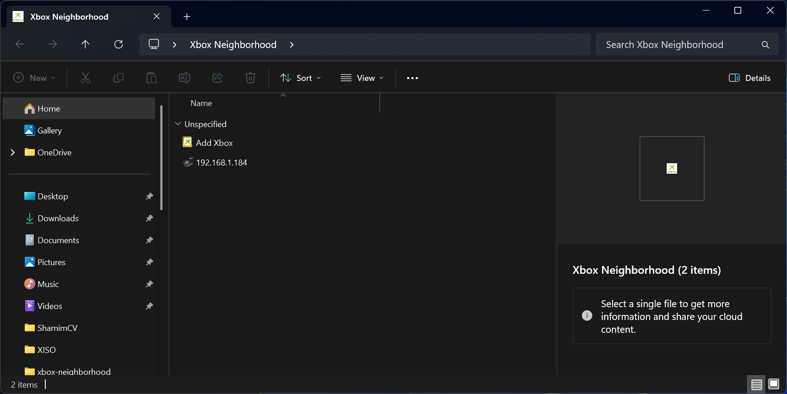
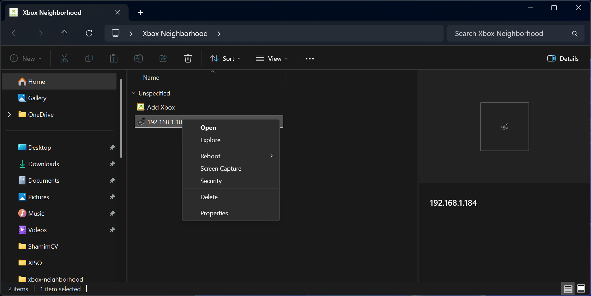

# RXDK Tools

<p align="center">
  <a href="https://discord.gg/VcdSfajQGK"></a>
  &nbsp;
  <a href="https://ko-fi.com/J3J7L5UMN"></a>
  &nbsp;
  <a href="https://www.patreon.com/teamresurgent"></a>
</p>

**Recompiled Original Xbox XDK host tools for 64-bit Windows 10 and Windows 11.**

The classic XDK shipped 32-bit utilities that no longer run on modern Windows. RXDK Tools rebuilds them as **managed .NET 8** ports (cross-platform CLI tools and Windows shell integration). **Xbox Neighborhood** is a managed **`Rxdk.XbShellExt`** COM shell extension over **`Rxdk.Xbdm.Managed`**. All console-facing tools talk to kits over the **Xbox Debug Monitor (XBDM)** protocol.

**What's included**

| Category | Tools |
|----------|-------|
| Explorer | **Xbox Neighborhood** shell extension (`Rxdk.XbShellExt.comhost.dll`) |
| Neighborhood app | **`RXDKNeighborhood.exe`** — Avalonia standalone browser (`RXDKTools.sln`) |
| File transfer | `xbcp`, `xbdir`, `xbmkdir`, `xbecopy` |
| Build | `imagebld` (PE → signed `.xbe`) |
| Debug | `xbox-launch`, **`Rxdk.XbWatson`** (cross-platform Avalonia), `xboxdbg-bridge` |

## Contents

- [Requirements](#requirements)
- [Quick start — Xbox Neighborhood (shell extension)](#quick-start--xbox-neighborhood-shell-extension)
- [Quick start — RXDKNeighborhood app](#quick-start--rxdkneighborhood-app)
- [Screenshots](#screenshots)
- [Tools](#tools)
  - [Xbox Neighborhood](#xbox-neighborhood-rxdkxbshlext)
  - [RXDKNeighborhood app](#rxdkneighborhood-app)
  - [File utilities](#file-utilities-xbcp-xbdir-xbmkdir-xbecopy)
  - [Image builder](#xbox-image-file-builder-imagebld)
  - [Launch helper](#launch-helper-xbox-launch)
  - [xbWatson](#xbwatson-xbwatsonexe)
  - [Debug bridge](#debug-bridge-xboxdbg-bridgeexe)
- [Build from source](#build-from-source)

## Requirements

- **64-bit** Windows 10 or Windows 11
- An Original Xbox **development kit** on the network (for console-facing tools)
- **Administrator** rights to install the shell extension (registered machine-wide; not required for the standalone Neighborhood app)

## Quick start — Xbox Neighborhood (shell extension)

1. Download or build **`XboxNeighborhood-Setup.exe`**
2. Run the installer **as administrator**
3. Open **Xbox Neighborhood** from the Start menu or desktop shortcut

The installer registers the shell extension and opens Neighborhood in Explorer. You can also navigate directly to:

```uri
shell:::{DB15FEDD-96B8-4DA9-97E0-7E5CCA05CC44}
```

### Dev register / unregister (from source)

Build **`Rxdk.XbShellExt`** (`Release | win-x64`), then stage and register locally (scripts prompt for UAC elevation when needed):

```powershell
.\scripts\register-xbshlext-dev.ps1
.\scripts\status-xbshlext-dev.ps1
.\scripts\unregister-xbshlext-dev.ps1
```

Repo-root **`register-shell-ext.cmd`** / **`unregister-shell-ext.cmd`** are convenience wrappers for the same scripts. Staged payloads: **`out/dev/xbshlext/`** (managed comhost + dependencies). Manual Explorer checks: [`docs/xbshlext-manual-checklist.md`](docs/xbshlext-manual-checklist.md).

## Quick start — RXDKNeighborhood app

Build or publish the Avalonia app (see [RXDKNeighborhood app](#rxdkneighborhood-app) below), then run **`RXDKNeighborhood.exe`**. No shell extension or admin install is required — the app talks to kits directly over XBDM.

1. **Add Console** and complete the wizard (name/IP, security if needed)
2. Select a console in the tree to browse drives
3. Double-click folders in the list to open them; use **Up** to go back

Console list persistence (shared via **`Rxdk.KitConfig`**):

| OS | Console list | Default console | IP cache |
|----|--------------|-----------------|----------|
| Windows | `HKCU\Software\Microsoft\XboxSDK\xbshlext\Consoles` | `HKCU\Software\Microsoft\XboxSDK\XboxName` | `HKCU\...\xbshlext\Addresses` |
| Linux / macOS | `%AppData%/RXDKNeighborhood/consoles.json` | JSON `DefaultConsole` | JSON per-console `IpAddress` |

On Windows, if the registry list is empty but `consoles.json` exists, consoles are migrated into the registry once.

**Cross-platform publish:**

```powershell
powershell -File scripts/publish-avalonia.ps1 -Runtime win-x64
powershell -File scripts/publish-avalonia.ps1 -Runtime linux-x64
```

```bash
./scripts/publish-avalonia.sh framework linux-x64
```

Published output: `out/publish/RXDKNeighborhood-<runtime>/`

## Screenshots

Click any image for full size.

<p align="center">
  <a href="images/neighborhood-overview.png"></a>
  &nbsp;
  <a href="images/console-context-menu.png"></a>
</p>
<p align="center">
  <a href="images/console-drives.png"></a>
  &nbsp;
  <a href="images/console-audio-folder.png"></a>
</p>

## Tools

Binaries build to **`out/bin/x64/Release/`**. Most CLI tools accept **`/x console`** to target a named kit. Xbox paths use the **`xE:\`**, **`xD:\`**, … prefix (for example `xE:\title\default.xbe`).

### Xbox Neighborhood (`Rxdk.XbShellExt`)

The headline feature — an **Xbox Neighborhood** entry in Windows Explorer for browsing kits on the network with familiar folder UI.

| Feature | Description |
|---------|-------------|
| Console management | Add kits via setup wizard, set default console, view name/IP columns |
| Volume browsing | Explore `C:`, `E:`, `T:`, `U:`, and other Xbox drives |
| File operations | Cut, copy, paste, delete, rename, drag-and-drop between PC and kit |
| XBE launch | Right-click an `.xbe` on the kit and choose **Launch** |
| Reboot | Warm, cold, or same-title reboot from the console context menu |
| Capture & security | Screenshot capture and security settings from the console menu |

Built as **`Rxdk.XbShellExt.comhost.dll`** with shared **`Rxdk.Xbdm.KitServices`** / **`RXDKNeighborhood.Core`** logic and WinForms UI in-process. Run **`setup/build-installer.ps1`** (or build from **`RXDKTools.sln`**) to produce **`XboxNeighborhood-Setup.exe`**.

### RXDKNeighborhood app

Modern **Avalonia** standalone browser (`RXDKTools.sln`) — browse kits, drives, and folders **without Explorer shell integration**. Uses the managed XBDM protocol stack in `Rxdk.Xbdm.Managed`.

| Feature | Description |
|---------|-------------|
| Console management | Add Xbox wizard, remove, set default, reboot, screenshot |
| Browse | Tree of consoles, drives, and folders; file list for contents |
| File operations | Cut, copy, paste, delete, rename, new folder, drag-and-drop |
| Copy to PC | Export to PC, or drag files/folders to Explorer |
| XBE launch | Launch `.xbe` files on the kit |
| Property pages | Console, drive, and file/folder properties |
| Security | Lock/unlock, users, permissions, admin password |

**Explorer-only** (requires shell extension registration):

| Shell extension only | Notes |
|----------------------|-------|
| Explorer integration | Namespace in This PC, details pane columns, desktop shortcuts |

**Build and run:**

```powershell
dotnet run --project src/RXDKNeighborhood/RXDKNeighborhood.csproj -c Release

# Publish distributable folder (Windows)
powershell -File scripts/publish-avalonia.ps1 -Runtime win-x64
```

Published output: `out/publish/RXDKNeighborhood-<runtime>/`

| Component | Location |
|-----------|----------|
| Avalonia app | `src/RXDKNeighborhood/` |
| C# core logic | `src/RXDKNeighborhood.Core/` |
| Managed XBDM client | `src/Rxdk.Xbdm.Managed/` |

Requires **.NET 8 SDK**.

### Managed CLI tools (cross-platform)

Single-file, self-contained builds of **`xbset`**, **`xbcp`**, **`xbdir`**, **`xbmkdir`**, **`xbecopy`**, **`imagebld`**, **`xbox-launch`**, and **`xboxdbg-bridge`** are published together as a flat **`tools/`** bundle in CI ( **`xbwatson`** remains a separate GUI publish).

```powershell
# Windows
powershell -File scripts/publish-managed-cli-tools.ps1 -Runtime win-x64

# Linux / macOS
./scripts/publish-managed-cli-tools.sh linux-x64
./scripts/publish-managed-cli-tools.sh osx-arm64
```

Output: `out/publish/managed-cli-tools-<runtime>/` (one executable per tool, no sidecar DLLs).

### Rxdk.XboxDbgBridge (NuGet)

Tool-only **`Rxdk.XboxDbgBridge`** NuGet package: self-contained **`xboxdbg-bridge`** binaries for **win-x64**, **linux-x64**, and **osx-arm64** under `tools/<rid>/` (stdin/JSON protocol for VS Code DAP). No library reference — spawn the executable. PDB/stack/locals require **Windows**; kit control is cross-platform.

```bash
dotnet pack src/Rxdk.XboxDbgBridge/Rxdk.XboxDbgBridge.csproj -c Release -o out/publish/nuget
```

After install, use `tools/<rid>/xboxdbg-bridge` or MSBuild `$(RxdkXboxDbgBridgeExe)` from `build/Rxdk.XboxDbgBridge.props`.

### File utilities (`xbcp`, `xbdir`, `xbmkdir`, `xbecopy`)

Classic XDK command-line tools for moving data between the PC and a kit. Shared path parsing and connection helpers live in **`Rxdk.XbFile`** (`src/Rxdk.XbFile/`).

| Tool | Purpose |
|------|---------|
| **`xbcp`** | Copy files to or from the kit (`/r` recursive, `/s` subdirs, `/d` copy-if-newer, `/y` no prompt, `/t` create dest dir, …) |
| **`xbdir`** | List files on PC or kit (`/r` recursive, `/b` bare names, `/w` columns, `/o` sort) |
| **`xbmkdir`** | Create a directory on the kit (`/t` creates parent path as needed) |
| **`xbecopy`** | Deploy a built image to a remote Xbox path — for VS post-build steps (`local.exe` → `xe:\path\title.xbe`) |

```cmd
xbcp /r /t mybuild\* xE:\title\
xbdir /r xE:\title
xbmkdir /t xE:\data\savegames
xbecopy Debug\game.xbe E:\title\game.xbe
```

### Xbox Image File Builder (`imagebld`)

Converts a Win32 **PE** executable into a signed **`.xbe`** title image — the same `imagebld` from the XDK build pipeline. Implementation: `src/Rxdk.ImageBld/` (`Rxdk.XbeImage` library) with golden-file tests for build and dump output; published as a single-file `imagebld` in CI alongside other managed tools.

| Switch | Purpose |
|--------|---------|
| **`/IN:`** / **`/OUT:`** | Input PE and output XBE paths |
| **`/STACK:`**, **`/INITFLAGS:`**, **`/INSERTFILE:`** | Image layout and embedded sections |
| **`/TITLEIMAGE:`**, **`/TITLEINFO:`**, **`/DEFAULTSAVEIMAGE:`** | Title metadata and save thumbnails |
| **`/TEST*`** | Title ID, name, region, ratings, signature key, certification fields |
| **`/DUMP`** | Inspect an existing `.xbe` and print headers/sections |

### Launch helper (`xbox-launch`)

Command-line **debug launches** for scripts or CI. Reboots the kit to pending exec (if needed), sets the title path, arms an initial breakpoint, and runs until the title stops at entry.

Implementation: `src/Rxdk.XboxLaunch.Cli/` (single-file `xbox-launch` in the CI `tools/` bundle).

```cmd
xbox-launch /dir xe:\path /title game.xbe [/cmd args] [/x console] [/reboot] [/timeout ms]
```

Subscribes to exec, break, module-load, and debug-string notifications. Useful for a deterministic “stop at main” session without opening the full Visual Studio debugger.

### xbWatson (`xbWatson.exe` / `Rxdk.XbWatson`)

GUI **break-notification** tool from the classic XDK. Leave it running while developing — it connects to the kit and surfaces debug events in a log window with modal dialogs for interactive cases.

**Cross-platform Avalonia port:** `src/Rxdk.XbWatson/` — managed XBDM (log window, assert/RIP/exception dialogs, `XBW1.0` crash dumps, `/x` CLI).

| Event | Behavior |
|-------|----------|
| Debug output | `DM_DEBUGSTR` text from the title |
| Asserts | Dialog with continue/ignore options |
| RIPs | Fatal error dialog with reboot choices |
| Breakpoints & exceptions | Break/exception handlers with register/context display |

```cmd
xbWatson [/x xboxname]
Rxdk.XbWatson [/x xboxname]
```

```powershell
# Publish Rxdk.XbWatson
powershell -File scripts/publish-xbwatson.ps1 -Runtime win-x64
powershell -File scripts/publish-xbwatson.ps1 -Runtime linux-x64
```

Build: `RXDKTools.sln` → `Rxdk.XbWatson`.

Pairs well with Neighborhood or `xbox-launch` when you want visible feedback from `DbgPrint`, asserts, and crashes without a full debugger attach.

### Debug bridge (`xboxdbg-bridge.exe`)

**JSON-over-stdio** debug host for modern editors and automation. Reads one JSON command per line on stdin, writes JSON results/events on stdout — intended for DAP front-ends and scripted debug sessions.

Supported commands:

```text
launch, attach, go, goUser, stop, step, waitBreak, setBreakpoint, resolveLine,
getMemory, getThreads, getStack, getVariables, evaluate, loadSymbols, shutdown
```

Symbol resolution uses **`dbghelp`** (PDB/map) with Xbox address relocation.

```powershell
echo '{"id":1,"cmd":"ping"}' | xboxdbg-bridge.exe
```

## Build from source

Requires **Visual Studio 2022** with **Desktop development with C++** (v145 toolset) for the native shell proxy DLL, plus **.NET 8 SDK** for managed projects.

1. Open **`RXDKTools.sln`**
2. Build **`Release | x64`**

| Output | Location |
|--------|----------|
| Managed tools & shell extension | `out/bin/x64/Release/` (via MSBuild/dotnet publish) |
| Neighborhood installer | `out/bin/x64/Release/XboxNeighborhood-Setup.exe` (built via `setup/build-installer.ps1`; Inno Setup installed automatically if missing) |

### Solution layout

Managed projects live under **`src/`**. The native **`Rxdk.XbShellExt.Shell`** C++ proxy (namespace `IShellFolder` host) lives alongside them. Shared C/C++ headers and helpers used by the shell proxy are under **`shared/`**.

| Project | Output | Role |
|---------|--------|------|
| `Rxdk.XbShellExt` | `Rxdk.XbShellExt.comhost.dll` | Managed Xbox Neighborhood shell extension |
| `Rxdk.XbShellExt.Shell` | `Rxdk.XbShellExt.Shell.dll` | Native shell namespace proxy |
| `Rxdk.XbCp`, `Rxdk.XbDir`, `Rxdk.XbMkdir`, `Rxdk.XbeCopy` | `*.exe` | File transfer utilities |
| `Rxdk.ImageBld` | `imagebld.exe` | PE → XBE image builder |
| `Rxdk.XboxLaunch.Cli` | `xbox-launch.exe` | CLI debug launch helper |
| `Rxdk.XbWatson` | `xbwatson.exe` | Break/assert/RIP notification UI |
| `Rxdk.XboxDbgBridge.Cli` | `xboxdbg-bridge.exe` | JSON debug bridge for editor integration (also in `Rxdk.XboxDbgBridge` NuGet) |

The standalone **`RXDKNeighborhood.exe`** Avalonia app is also in **`RXDKTools.sln`** — see [RXDKNeighborhood app](#rxdkneighborhood-app).
